# 🔵 blue-team-lab

> Home SOC Lab — ataque, detección, análisis, documentación. Repeat.

Un entorno personal de ciberseguridad defensiva construido para practicar detección de amenazas, análisis forense y threat hunting usando herramientas reales sobre infraestructura propia. Cada escenario está documentado como write-up técnico con mapeo a MITRE ATT&CK.


---

## Arquitectura



| Componente | OS | Rol | IP |
|---|---|---|---|
| Wazuh Manager | Ubuntu Server 22.04 | SIEM / SOC Core | 192.168.1.100 |
| Kali Linux | Kali Rolling | Attacker | 192.168.1.10 |
| Windows Victim | Windows 10 Eval | Target + Wazuh Agent | 192.168.1.20 |
| Linux Victim | Ubuntu Desktop | Target + Wazuh Agent | 192.168.1.30 |

---

## Estructura del repositorio

```
blue-team-lab/
├── architecture/
│   ├── lab-diagram.svg          # Diagrama visual del lab
│   └── network-setup.md         # Configuración de red y VMs
├── wazuh/
│   ├── rules/                   # Reglas custom de detección
│   ├── decoders/                # Decoders personalizados
│   └── configs/                 # Configuraciones del manager
├── detections/
│   └── YYYYMMDD-nombre/         # Una carpeta por escenario
│       ├── README.md            # Write-up completo
│       ├── attack.md            # Comandos y TTPs usados
│       ├── detection.md         # Alertas generadas y análisis
│       └── screenshots/         # Evidencia visual
├── playbooks/
│   └── IR-*.md                  # Playbooks de respuesta a incidentes
├── threat-hunting/
│   └── queries/                 # KQL / Wazuh queries reutilizables
└── resources.md                 # Referencias y herramientas
```

---

## Escenarios documentados

| # | Escenario | MITRE TTP | Dificultad | Status |
|---|-----------|-----------|------------|--------|
| 01 | SSH Brute Force Detection | T1110.001 | 🟢 Fácil | 🔄 En progreso |
| 02 | Web Shell Upload | T1505.003 | 🟡 Media | 📍 Pendiente |
| 03 | Privilege Escalation — Linux | T1068 | 🟡 Media | 📍 Pendiente |
| 04 | Credential Dumping — Windows | T1003 | 🟡 Media | 📍 Pendiente |
| 05 | C2 Beacon con Metasploit | T1071.001 | 🔴 Alta | 📍 Pendiente |
| 06 | Lateral Movement — SMB | T1021.002 | 🔴 Alta | 📍 Pendiente |
| 07 | Persistence — Cron / Registry | T1053 | 🟡 Media | 📍 Pendiente |
| 08 | Data Exfiltration simulada | T1041 | 🔴 Alta | 📍 Pendiente |

---

## Reglas custom de Wazuh

Reglas desarrolladas durante el lab, disponibles en [`/wazuh/rules/`](./wazuh/rules/):

> Se irán agregando conforme avancen los escenarios.

---

## Stack

- **SIEM:** Wazuh 4.x (manager + agents)
- **Attacker:** Kali Linux — nmap, hydra, metasploit, mimikatz, gobuster
- **Monitoring:** Sysmon (Windows), Auditd (Linux), OSQuery
- **Framework:** MITRE ATT&CK
- **Scripting:** Python, Bash, PowerShell

---

## Write-up template

Cada escenario sigue esta estructura en su `README.md`:

```
## Escenario: [Nombre]
**MITRE ATT&CK:** [TTP ID] — [Nombre de la técnica]
**Dificultad:** Fácil / Media / Alta
**Fecha:** YYYY-MM-DD

### Objetivo
Qué se intenta detectar y por qué.

### Setup
Prerequisitos y configuración previa.

### Ataque
Comandos ejecutados desde Kali, paso a paso.

### Detección
- Alerta generada en Wazuh (ID, nivel, descripción)
- Log raw que disparó la regla
- Análisis de la regla

### Análisis forense
Timeline, artefactos encontrados, pivoting.

### Respuesta sugerida
Acciones de contención y remediación.

### Lecciones aprendidas
Qué funcionó, qué no, cómo mejorar la detección.
```

---

## Referencias

- [MITRE ATT&CK](https://attack.mitre.org/)
- [Wazuh Documentation](https://documentation.wazuh.com/)
- [Sigma Rules](https://github.com/SigmaHQ/sigma)
- [HackTheBox Sherlocks](https://app.hackthebox.com/sherlocks) — práctica de Blue Team

---

*Proyecto activo — actualizado conforme avanzan los escenarios.*
